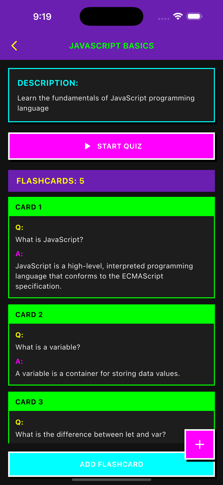

# Flashcard Flutter App

A modern microlearning app built with Flutter that helps users learn efficiently using flashcards and quizzes. Perfect for students, self-learners, and professionals looking to boost memory retention and track learning progress.

---

## Features

### User Authentication
- **Sign Up**: Create a new account.
- **Sign In**: Log in securely using email and password.

### Home Page
- Overview of user-created decks.
- Quick access to recent or favorite decks.
- Search decks by title.

### Deck Management
- **Create Decks**: Add new topic-based decks.
- **Edit Decks**: Update title, description, and content.
- **Delete Decks**: Remove unwanted decks.
- **Deck Details**: View all flashcards inside a deck.

### Flashcard Functionality
- Add individual flashcards to decks.
- Edit and delete flashcards.
- Flip animations for front/back review.

### Explore Page
- Browse predefined/public decks curated for learning.
- Import and study ready-made decks.

### Progress & Stats
- Track how many flashcards you've studied.
- Monitor right/wrong answers and view:
  - Total flashcards studied
  - Correct vs. incorrect count
  - **Accuracy %**

### Quiz Mode
- Test yourself on a deck with quiz-style flashcards.
- Instant feedback on your answers.

---

## Tech Stack

- **Flutter** (frontend)
- **Firebase** (authentication, database)

---

## Screenshots

| Step | Screen | Preview |
|------|--------|---------|
| 1️⃣ | **Landing Page** – Welcome screen introducing the app |  |
| 2️⃣ | **Sign Up Page** – New users can create an account |  |
| 3️⃣ | **Sign In Page** – Returning users can log in |  |
| 4️⃣ | **My Decks** – Home view showing your created decks |  |
| 5️⃣ | **Deck Details** – View and manage flashcards within a deck |  |
| 6️⃣ | **Quiz Screen** – Test your knowledge using a quiz format |  |
| 7️⃣ | **Explore Decks** – Discover and study public decks |  |
| 8️⃣ | **Progress/Stats** – Visual insights into your study performance |  |

---

### Authentication Testing
Tests the core functionality of user login and signup.

- Valid signup creates a new user
- Valid login navigates to the home screen
- Invalid credentials show error messages
  

---

### Deck CRUD Testing
Covers creation, update, and deletion of decks and flashcards.

- Create a new deck and verify in My Decks
- Edit an existing deck title
- Add and delete flashcards
- Duplicate deck names should be handled gracefully

  
